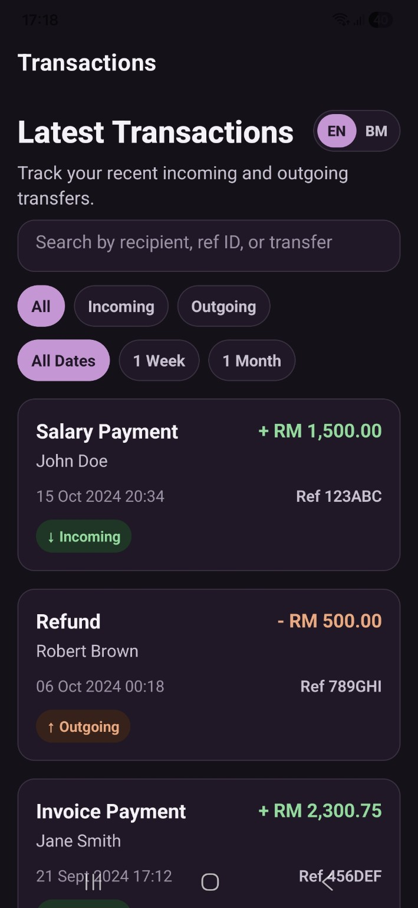
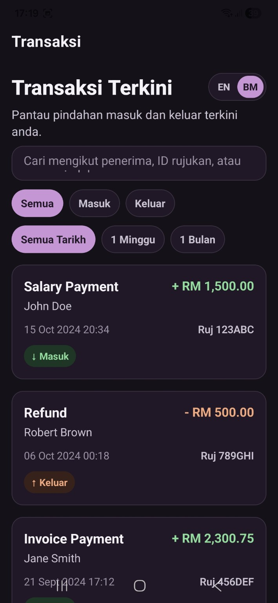
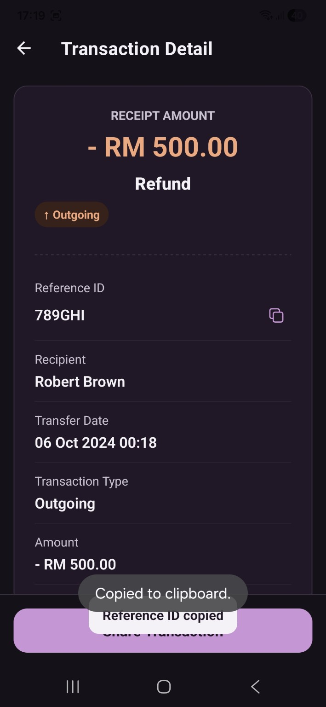
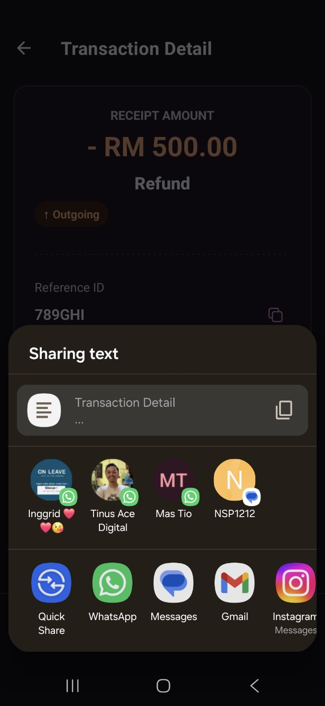

# AEON Bank Transaction MVP

This project is a small React Native banking app built for the AEON Bank Senior Mobile Developer assessment. The core flow is intentionally simple: a customer can review recent transfer transactions, open a receipt-style detail page, copy the reference ID, and share the transaction receipt externally.

I treated this as a banking-grade MVP rather than a feature-heavy prototype. The goal was to keep the app easy to review, easy to extend, and clear enough that another developer could continue from it without needing much explanation.

## Screenshots

<table>
  <tr>
    <td align="center"><strong>Transactions - English</strong></td>
    <td align="center"><strong>Transactions - Bahasa Malaysia</strong></td>
  </tr>
  <tr>
    <td></td>
    <td></td>
  </tr>
  <tr>
    <td align="center"><strong>Transaction Detail</strong></td>
    <td align="center"><strong>Native Share Flow</strong></td>
  </tr>
  <tr>
    <td></td>
    <td></td>
  </tr>
</table>

## MVP Scope

The MVP focuses on the most important banking customer actions:

```text
Open app
  |
  v
Review latest transactions
  |
  +-- Search / filter transactions
  |
  v
Tap one transaction
  |
  v
Review receipt-style details
  |
  +-- Copy reference ID
  |
  +-- Share transaction receipt
```

The app does not try to solve authentication, real API integration, PDF generation, or offline persistence yet. Those are valid next steps, but they are outside the useful MVP boundary for this assessment.

## Features

- Latest transactions sorted by transfer date descending.
- Pull-to-refresh.
- Loading, empty, error, and no-matching-results states.
- Search by transfer name, recipient name, reference ID, amount, and transaction type.
- 300ms debounced search.
- Type filter: All, Incoming, Outgoing.
- Date range filter: All Dates, 1 Week, 1 Month.
- Receipt-style transaction detail page.
- Copyable reference ID with snackbar confirmation.
- Share transaction details through the native Share API.
- English and Bahasa Malaysia UI labels.
- EN / BM language toggle.
- System-aware light and dark mode.
- Accessibility labels and stable `testID` values.

## Why This Approach

The assessment asks for a focused transaction list and detail flow. For that kind of scope, I avoided adding heavy infrastructure that would make the project look bigger than the problem. At the same time, I kept the important seams in place:

- Transaction data is accessed through a repository interface.
- Zustand coordinates screen data, loading, and error state.
- UI state like search, filters, snackbar visibility, and language selection stays close to where it is used.
- Formatting, sorting, filtering, and receipt text generation live outside the screen components.
- Native APIs such as Share and Clipboard are wrapped behind small services.

That gives the project a clean structure without turning a take-home assessment into a framework exercise.

## Tech Stack

- Expo SDK 54
- React Native 0.81
- TypeScript with `strict` mode
- Zustand
- AsyncStorage-backed persistence
- React Navigation native stack
- Jest with `jest-expo`
- React Native Testing Library

Expo SDK 54 requires Node 20.19.x or newer. Older Node versions may still run some commands, but package tools can show engine warnings.

## Architecture

The screen layer follows a lightweight MVVM style. I chose MVVM over MVC because it fits React Native hooks naturally: the screen renders the view, and a hook owns the state/actions needed by that view.

```text
UI Components
  |
  v
Screens / Views
  |
  v
ViewModels (screen hooks)
  |
  v
Zustand Stores
  |
  v
Repositories / Services
  |
  v
Mock Data / Native APIs
```

For example, the transaction detail screen is split like this:

```text
transactionDetail/
  TransactionDetailScreen.tsx        View composition
  useTransactionDetailViewModel.ts   Detail lookup, copy, share actions
  styles.ts                          Screen-level styles
```

The transaction list screen follows the same idea:

```text
transactionList/
  TransactionListScreen.tsx          View composition
  useTransactionListViewModel.ts     List state, filters, navigation actions
  TransactionListHeader.tsx          Header + language toggle
  SearchAndFilters.tsx               Search and filter controls
  FilterGroup.tsx                    Reusable filter chip row
  styles.ts                          Screen-level styles
```

## Data Flow

```text
MockTransactionRepository
  |
  v
transactionStore.fetchTransactions()
  |
  v
sortTransactionsByLatest()
  |
  v
TransactionList ViewModel
  |
  +-- debounce search query
  +-- filter by query
  +-- filter by type
  +-- filter by date range
  |
  v
TransactionListScreen
```

For transaction details, only the `refId` is passed through navigation. The detail screen then retrieves the transaction from the Zustand store.

```text
TransactionCard press
  |
  v
navigation.navigate("TransactionDetail", { refId })
  |
  v
transactionStore.getTransactionByRefId(refId)
  |
  v
Receipt-style detail screen
```

This keeps navigation params small and avoids passing full transaction objects between screens.

## Project Structure

```text
src/
  app/                    React Navigation setup
  components/             Shared UI components
  data/                   Mock backend response
  hooks/                  Reusable hooks such as useDebounce
  i18n/                   English and Bahasa Malaysia dictionaries
  repositories/           TransactionRepository abstraction and mock implementation
  screens/                MVVM-style screen folders
  services/               Share and clipboard service wrappers
  store/                  Zustand stores
  theme/                  Light/dark colors, spacing, typography, theme hook
  types/                  Navigation and transaction types
  utils/                  Currency, date, transaction helpers
  __tests__/              Unit and component tests
```

## Engineering Decisions

### Repository abstraction

The store depends on `TransactionRepository`, not raw mock data. Today it uses `MockTransactionRepository`, but later it can be replaced with an API implementation without touching screens.

```text
TransactionRepository
  |
  +-- MockTransactionRepository
  |
  +-- FutureApiTransactionRepository
```

### Zustand usage

Zustand is used for app-level state that multiple screens care about:

- transactions
- loading and error state
- selected language preference
- cached transactions for a faster app restart experience

Search query and filters are kept local to `TransactionListScreen` through its ViewModel because they are screen-specific UI state.

Only useful long-lived state is persisted. Transaction cache and language preference survive app restarts, while loading and error state are kept runtime-only so the app does not reopen in a stale loading or failed state.

### Formatting and filtering

Currency formatting, date formatting, transaction type derivation, sorting, searching, and filtering are pure utility functions. This keeps JSX readable and makes the logic easy to test.

### Native API wrappers

`Share.share` and Expo Clipboard are wrapped in small services. This keeps native API usage contained and makes screen behavior easier to test.

### Theme and localization

The app uses a lightweight dictionary approach instead of a full i18n library. That is enough for two languages and keeps the project simple.

The theme uses system color scheme through `useColorScheme`, with separate light and dark color tokens. The dark theme avoids pure black and overly bright colors so the UI still feels calm and banking-friendly.

## Design Approach

The UI is designed with a digital banking experience in mind: clear transaction hierarchy, accessible color contrast, predictable navigation, and receipt-style transaction details. Incoming and outgoing transactions are visually differentiated through amount formatting, badges, and icons to reduce user confusion. The detail page is structured like a transaction receipt so users can quickly verify important information before sharing.

The visual direction is intentionally quiet:

- soft lavender background in light mode
- calm dark surface in dark mode
- white or dark card surfaces
- strong but not aggressive incoming/outgoing colors
- readable amount and reference information
- minimal controls that match the transaction review task

## Testing

The test suite covers the business logic and important UI behavior:

- currency formatting
- date formatting
- transaction sorting
- search by transfer name, recipient, and ref ID
- case-insensitive search
- type filtering
- date range filtering
- transaction card rendering and press behavior
- transaction detail rendering
- fallback state for missing transaction
- share behavior
- localized share receipt labels
- copy reference ID snackbar behavior

Run tests:

```bash
npm test
```

Run TypeScript verification:

```bash
npx tsc --noEmit
```

## Setup

```bash
npm install
```

## Run

```bash
npm start
```

Then open the app in Expo Go, an iOS simulator, or an Android emulator.

## MVP Conclusion

This MVP keeps the core customer journey clear: review transactions, find the right transaction quickly, verify the details, copy the reference ID if needed, and share a clean receipt.

The code is structured to show maintainability without overbuilding. The app can grow into a real banking feature by replacing the repository, adding authentication, and expanding filters without rewriting the screen layer.

## Future Improvements

- API integration with authentication
- Transaction filtering by exact date range
- Secure storage for user session
- PDF receipt generation
- Offline sync and cache invalidation strategy
- Biometric authentication
- E2E tests with Detox
